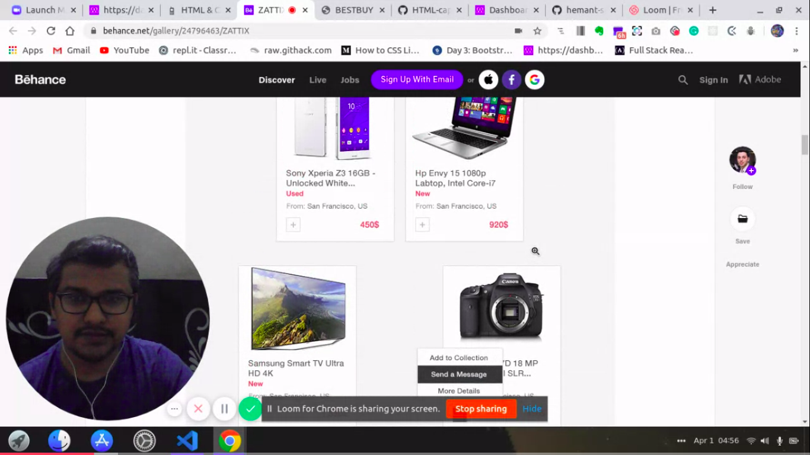
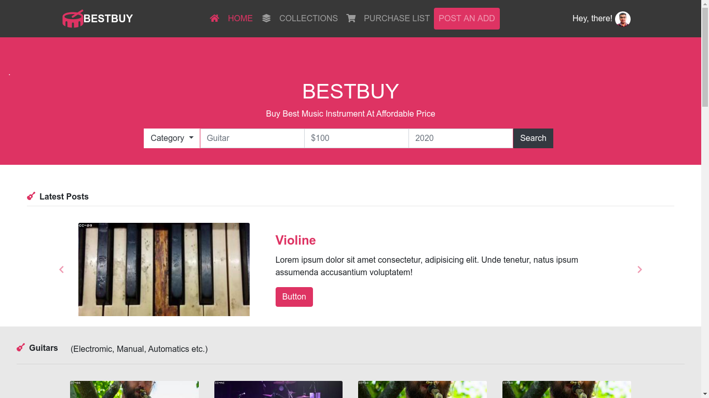
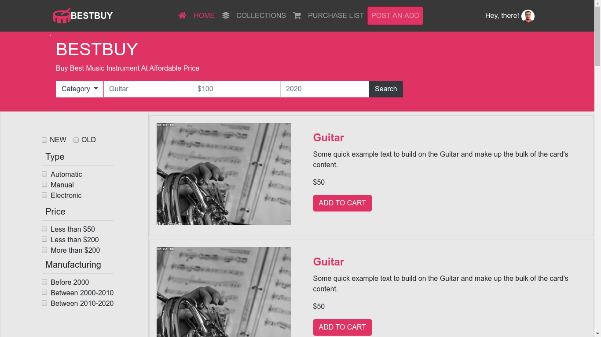
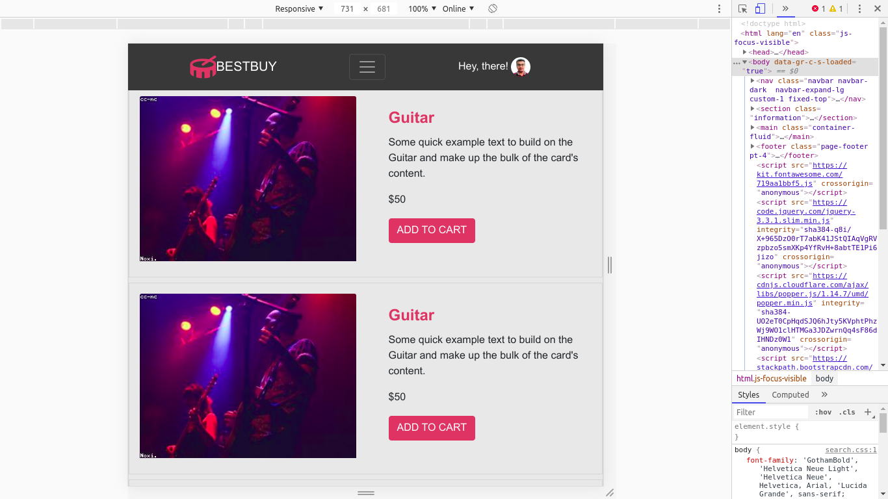
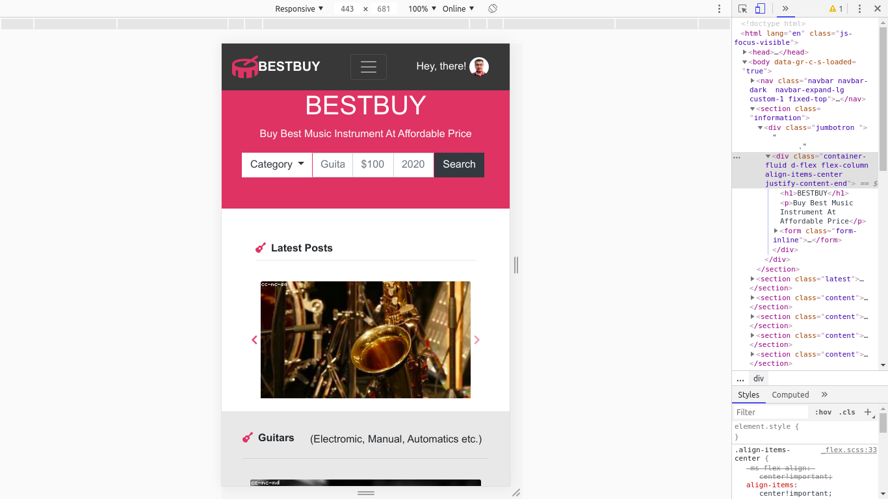
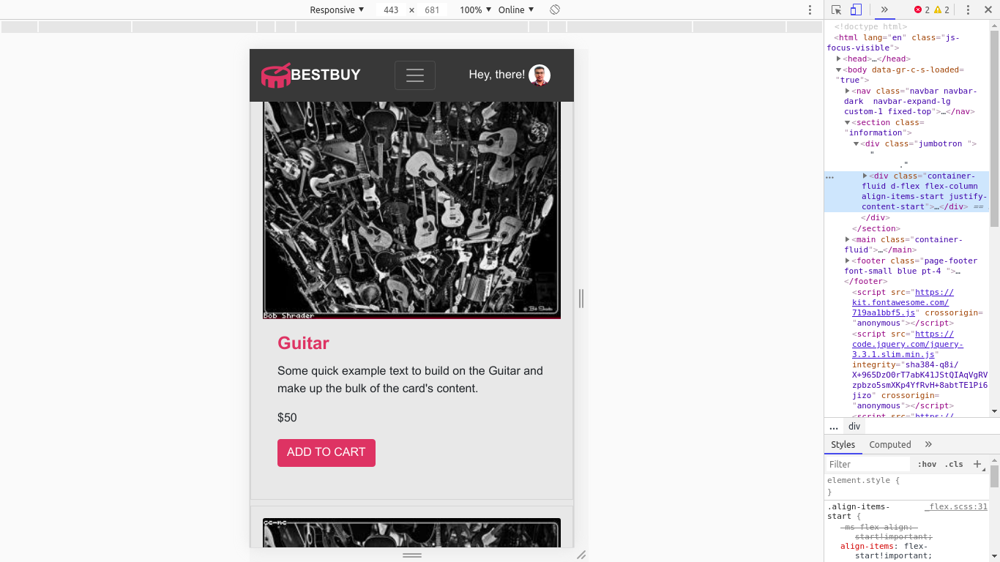

# BESTBUY - Online Music instrument shopping website 

> This project is the capstone project of Microverse curriculum HTML and CSS3 section. The website is about the BESTBUY(Online Music instrument shopping website), a place where people can buy Music instruments. The website contains 2 pages, main page where I introduced the different category of instruments, the search page where I presented the searched query items. All the pages are responsive (break point 768px) and the design is inspired by Mohammed Awad in Behance.

## Built With

- HTML,
- CSS,
- Flexbox layout.
- Grid layout.
- Bootstrap.

## Live Demo [Live Demo

[Live Demo Link](https://rawcdn.githack.com/hemant-soni-vst-au4/bestbuy/ac43db14b171f20ea828eaf80f467921c2d9ba87/index.html)

## Video presentation

## Desktop views

- Main page
 

- Search page

## Desktop views

- Main page
 

- Search page

## Mobile views

- Main page

- Search page

## Authors

👤 **Hemant soni**

- Github: [@githubhandle](https://github.com/hemant-soni-vst-au4)
- Twitter: [@twitterhandle](https://twitter.com/abdelperez11)
- Linkedin: [linkedin](https://www.linkedin.com/in/hemant-soni-97427b193/)

## 🤝 Contributing

Contributions, issues and feature requests are welcome! Start by:

* Forking the project
* Cloning the project to your local machine
* `cd` into the project directory
* Run `git checkout -b your-branch-name`
* Make your contributions
* Push your branch up to your forked repository
* Open a Pull Request with a detailed description to the development branch of the original project for a review

Feel free to check the [issues page](issues/).

## Show your support

Give a ⭐️ if you like this project!

## Acknowledgments

- https://www.microverse.org/.

## Credits
📄💻 Layouts design by <a href="https://www.behance.net/M_Awad" target="_blank">Mohammed Awad in Behance</a>

## 📝 License

This project is [MIT](lic.url) licensed.